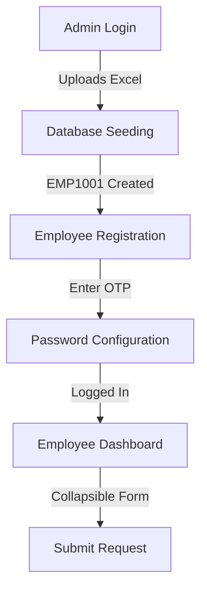

# 🤝 Samadhan App (TSL Employee Request Portal)

Samadhan is a request-raising mobile portal built for **TSL** (Tata Steel Limited) employees. It is designed to be simple, clean, and easy to set up.

---

## 🗺️ Application Work Flow

This is how the application runs from start to finish:



### 1. The Admin Flow
*   **Log in**: Access with default admin credentials (`admin` / `admin123`).
*   **Upload**: Select the employee spreadsheet (`backend/employees.xlsx`).
*   **Import**: Click upload to automatically bulk-register all TSL employees in the database.

### 2. The Employee Activation Flow
*   **Configure**: Tap **Configure Account** and enter your Employee ID (e.g. `EMP1001`).
*   **Verify**: Enter the OTP (a mock pop-up code appears in development mode).
*   **Password**: Create your password to activate the account.

### 3. The Request Flow
*   **Dashboard**: View active status and the expandable request form.
*   **Fill**: Fill in Category, Area Details, Material Details, and files.
*   **Submit**: Submit the form to save the request under your profile.

---

## 🚀 Setup Flow (Step-by-Step)

Follow these steps in order to get the project running locally.

### Step 1: Prerequisites
*   [Node.js](https://nodejs.org/) (v18+) installed on your PC.
*   [Expo Go](https://expo.dev/client) app installed on your phone.
*   A free account on [MongoDB Atlas](https://www.mongodb.com/).

### Step 2: Database Setup
1.  Log into MongoDB Atlas, create a free database, and get your connection string.
2.  In **Network Access**, add IP `0.0.0.0/0` (allow access from anywhere).

### Step 3: Run the Backend
1.  Open terminal in `backend/` folder.
2.  Install packages:
    ```bash
    npm install
    ```
3.  Create `.env` file from the example template:
    ```bash
    cp .env.example .env
    ```
4.  Add your MongoDB connection string inside the `.env` file:
    ```env
    MONGODB_URI=your_mongodb_connection_string
    ```
5.  Start the server:
    ```bash
    npm run dev
    ```

### Step 4: Run the Mobile App
1.  Find your computer's local IP address (e.g., `192.168.1.37`).
2.  Open a new terminal in `frontend/` folder.
3.  Install packages:
    ```bash
    npm install
    ```
4.  Create `.env` file:
    ```env
    EXPO_PUBLIC_API_URL=http://YOUR_LOCAL_IP_ADDRESS:5001
    ```
5.  Start Expo Metro bundler:
    ```bash
    npx expo start
    ```
6.  Connect your phone to the **same Wi-Fi network** as your PC, scan the QR code using your phone camera (iOS) or Expo Go app (Android), and enjoy!
