# 🤝 Samadhan Portal (TSL Employee Gate Pass Request System)

Samadhan is an enterprise-grade mobile-first portal designed for **Tata Steel Limited (TSL)** employees to digitize, streamline, and automate the request-raising, routing, and approval workflow for material gate passes. It eliminates manual paperwork, physical signature hunting, and operational delays.

---

## 📋 Table of Contents
1. [Executive Summary & Problem Statement](#-executive-summary--problem-statement)
2. [Key Features](#-key-features)
3. [System Architecture](#-system-architecture)
4. [Request Workflow Lifecycle](#-request-workflow-lifecycle)
5. [Database Schema Reference](#-database-schema-reference)
6. [API Route Reference](#-api-route-reference)
7. [Installation & Setup Guide](#-installation--setup-guide)
8. [Verification Flow](#-verification-flow)
9. [📊 PPT Slide-by-Slide Presentation Guide](#-ppt-slide-by-slide-presentation-guide)

---

## 💡 Executive Summary & Problem Statement

### The Problem
At major manufacturing plants like Tata Steel, moving materials (both normal and hazardous) in and out of division gates requires rigorous authorization. Traditionally, this process relied on paper forms, manual approvals, physical hand-offs, and phone calls. This led to:
- **Lack of Tracking**: No central log of where a gate pass was stuck in the approval chain.
- **Delay in Clearances**: Significant time wasted seeking physical signatures from managers, IBMD, and Sales.
- **Security & Safety Risks**: Prone to unauthorized modifications or manual errors, especially when handling hazardous items.
- **Administrative Overhead**: Creating employee logins manually for large plant operations was slow and error-prone.

### The Solution: Samadhan
**Samadhan** is a digital solution that solves these bottlenecks:
- **Instant Digital Requests**: Employees raise gate passes directly from a mobile device.
- **Automated Workflow Routing**: Requests automatically route to supervisors, IBMD, and Sales based on the material type.
- **Robust Role-Based Control**: Enforces precise permissions across 5 roles (*Employee, Approver, IBMD, Sales, Administrator*).
- **Bulk Onboarding**: Seeding thousands of plant employees at once using admin Excel uploads.
- **Secure Activation**: Verify and active profiles with secure OTP verification.

#### 📱 App Preview
Here is a sneak peek of the **Samadhan Mobile App** (Sign-in and Home Dashboard):

<p align="center">
  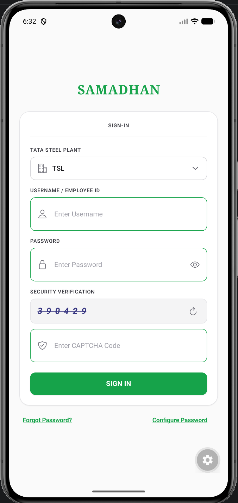
  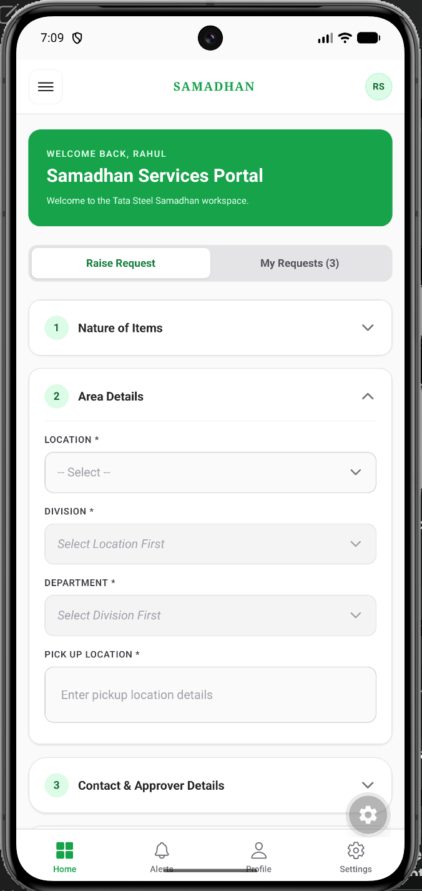
</p>

---

## ✨ Key Features
- **OTP Account Activation**: Secure first-time activation utilizing OTP verification (with simulated fallback for local development).
- **Hierarchical Structuring**: Built-in master models for Locations, Divisions, and Departments of Tata Steel.
- **Bulk Excel Provisioning & Central Registry**: Admins upload spreadsheet lists to onboard groups of employees instantly, feeding directly into the employee list directory.
  
  <p align="center">
    
    
  </p>

- **Attachments Upload**: Upload up to 3 material verification photos/documents directly from the mobile app.
- **Dynamic Sequential Workflow**: Handles approval routing, conditional state checks for hazardous materials, and final closures.
- **Audit Logs & Progress Timelines**: Complete tracking showing who approved/rejected with time-stamps and remarks.
- **Email Alerts**: Automatic emails sent to designated approvers, IBMD, Sales, and employees on transition.

---

## 🏛️ System Architecture

The application is built on a clean, decoupled **Client-Server-Database** architecture. Below is a visual map of the system components and dependencies:

<p align="center">
  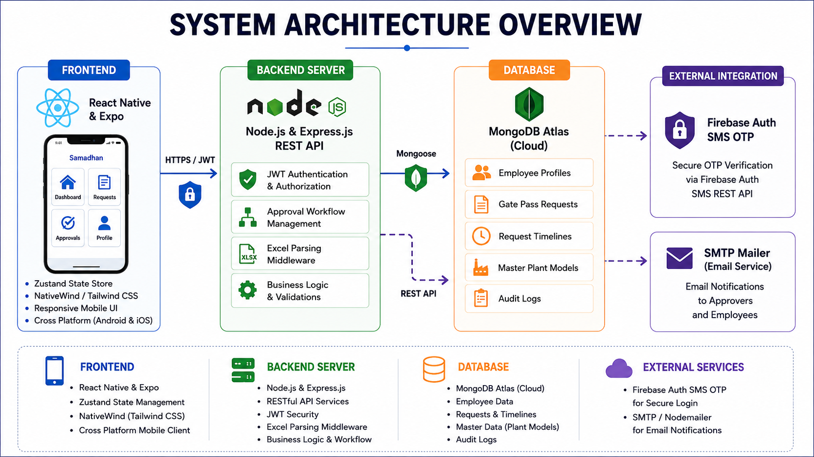
</p>

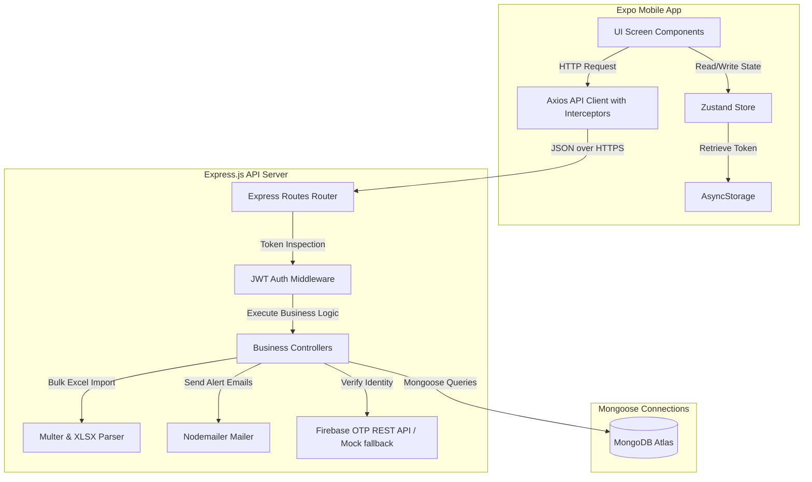

### Tech Stack Details
*   **Mobile App (Frontend)**: React Native with Expo (v51+), Zustand (State Store), Expo Router (File-based navigation), Tailwind CSS / NativeWind (Premium UI rendering), Axios (with request/response interceptors for JWT injection).
*   **Web Server (Backend)**: Node.js, Express.js, JWT (Token-based security), Multer (File uploads), XLSX (Excel parsing engine), Nodemailer (Alert dispatches).
*   **Database**: MongoDB Atlas managed cluster with Mongoose ORM.

---

## 🔄 Request Workflow Lifecycle

The portal implements a strict state machine routing pass requests based on item classification:

<p align="center">
  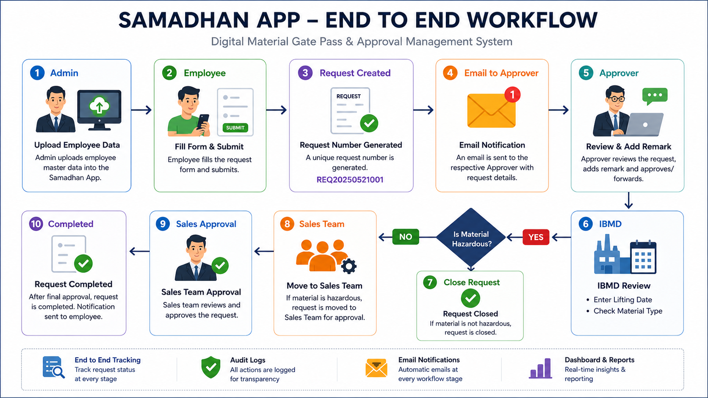
</p>

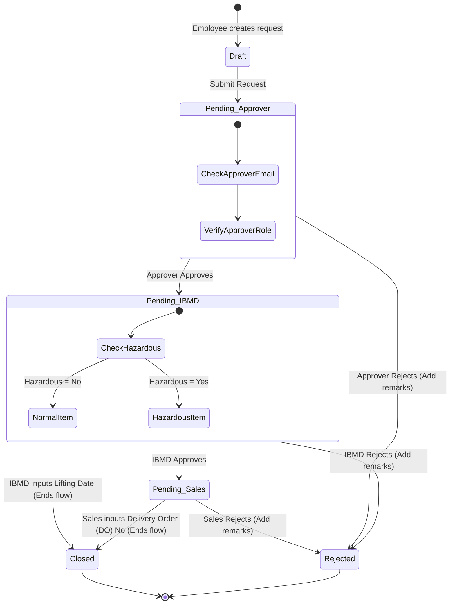

### Step-by-Step Approval Walkthrough

Here is the exact journey of a material gate pass request, along with the actual screens:

#### 1️⃣ Step 1: Employee Raises Request
The requester fills out a structured gate pass form specifying the nature of items, Tata Steel plant area details, material metrics, and uploads up to 3 verification photos.

<p align="center">
  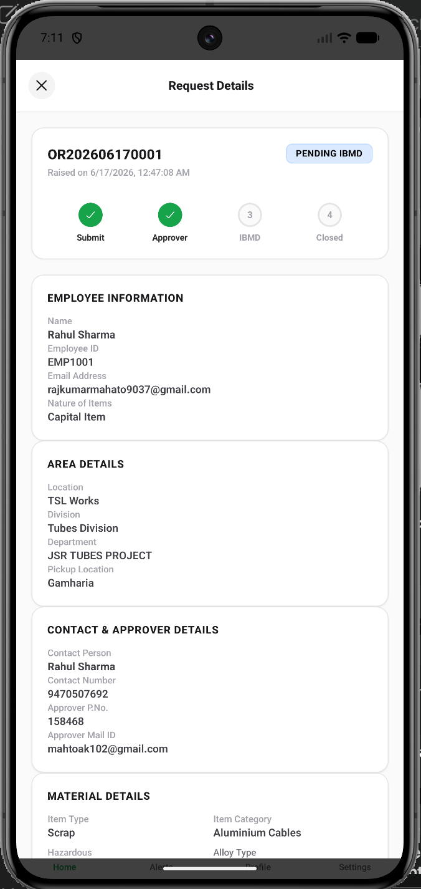
</p>

#### 2️⃣ Step 2: Supervisor Approval
The designated supervisor gets an email alert and reviews the request. They can either **Approve & Forward** it to the IBMD queue or **Reject** it (requires entering mandatory audit remarks).

<p align="center">
  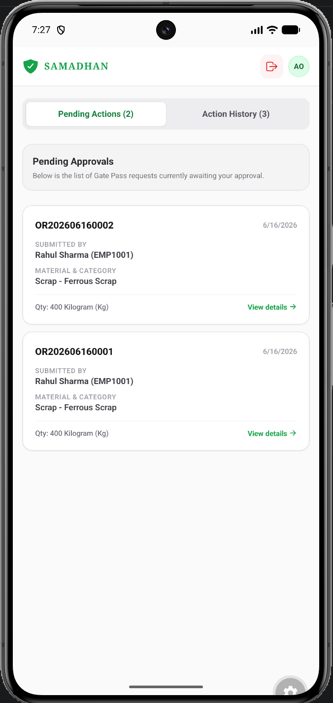
</p>

*If a supervisor needs to send a request back to draft, they enter rejection remarks:*

<p align="center">
  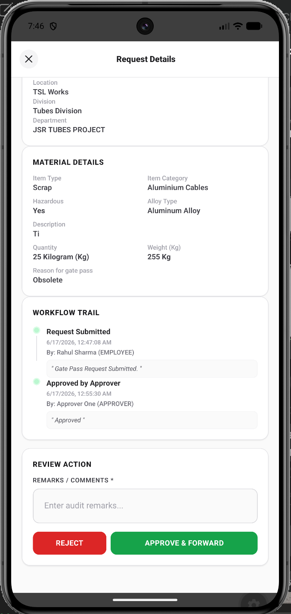
</p>

#### 3️⃣ Step 3: IBMD Review & Branching
The request is audited by the **Industrial By-Product Management Division (IBMD)**.
* **For Normal Materials**: IBMD enters the scheduled **Lifting Date** which directly closes the request.
* **For Hazardous Materials**: IBMD reviews, approves, and forwards the ticket to Sales.

<p align="center">
  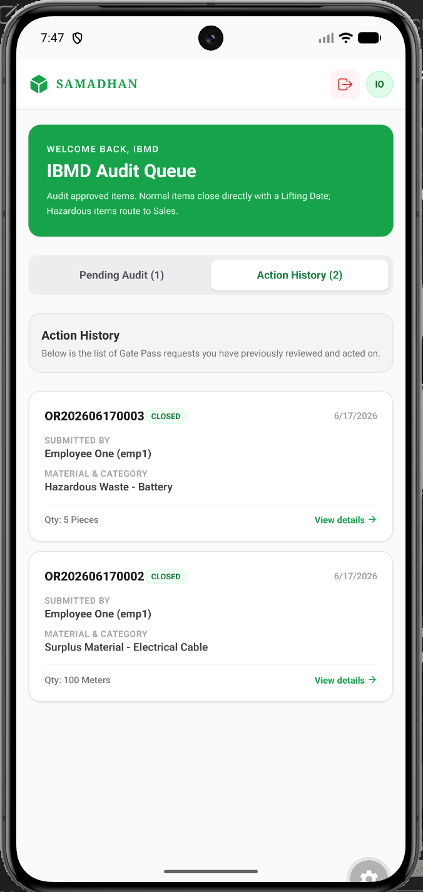
</p>

#### 4️⃣ Step 4: Sales DO Assignment (For Hazardous Items Only)
The Sales team verifies commercial clearances for hazardous materials, inputs the official **Delivery Order (DO) Number**, and closes the request.

<p align="center">
  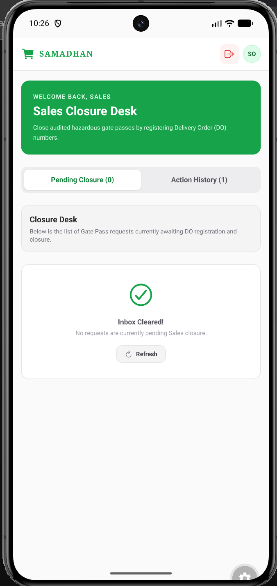
</p>

#### 5️⃣ Step 5: Gate Pass Closure
Once the final clearance is recorded, the request transitions to **Closed**. A full digital audit timeline is preserved showing everyone's signatures and timestamps.

<p align="center">
  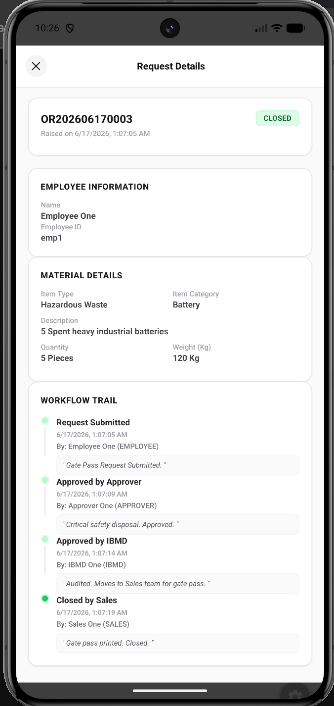
</p>

---

## 🗄️ Database Schema Reference

The system utilizes five collections in MongoDB:

### 1. Employee Collection (`Employee`)
```javascript
{
  emp_id: { type: String, required: true, unique: true },
  name: { type: String, required: true },
  phone: { type: String, required: true },
  email: { type: String, required: true },
  department: { type: String, required: true },
  designation: { type: String, required: true },
  password: { type: String, default: null }, // Null denotes inactive profile
  firstLogin: { type: Boolean, default: true },
  status: { type: String, enum: ['active', 'inactive'], default: 'active' },
  role: { type: String, enum: ['employee', 'admin', 'approver', 'ibmd', 'sales'] },
  createdAt: { type: Date, default: Date.now }
}
```

### 2. Request Collection (`Request`)
```javascript
{
  requestNo: { type: String, required: true, unique: true },
  employeeId: { type: mongoose.Schema.Types.ObjectId, ref: 'Employee' },
  employeeDetails: { emp_id: String, name: String, email: String },
  natureOfItems: { type: String, required: true },
  areaDetails: {
    location: String, locationId: ObjectId,
    division: String, divisionId: ObjectId,
    department: String, departmentId: ObjectId,
    pickupLocation: String
  },
  contactDetails: { contactPerson: String, contactNumber: String, userDept: String },
  approverDetails: { approverPNo: String, approverMailId: String },
  materialDetails: {
    itemType: String, itemCategory: String,
    hazardousItems: String, // 'Yes' or 'No'
    umc: String, umcRemarks: String, alloyType: String,
    itemDescription: String, quantity: Number, uom: String,
    weight: Number, remarks: String, reason: String
  },
  attachments: { attachment1: String, attachment2: String, attachment3: String },
  liftingDate: { type: String, default: null },
  doNo: { type: String, default: null },
  status: { type: String, enum: ['pending_approver', 'pending_ibmd', 'pending_sales', 'closed', 'rejected'] },
  timeline: [{
    status: String,
    actionBy: { type: mongoose.Schema.Types.ObjectId, ref: 'Employee' },
    actionByName: String,
    actionByRole: String,
    remarks: String,
    timestamp: { type: Date, default: Date.now }
  }]
}
```

### 3. Master Data Collections (`Location`, `Division`, `Department`)
Stores TSL's organisational hierarchy to prevent manual entries and spelling mistakes:
- **Location**: `{ name: String, active: Boolean }`
- **Division**: `{ name: String, locationId: ObjectId, active: Boolean }`
- **Department**: `{ name: String, divisionId: ObjectId, active: Boolean }`

---

## 🔌 API Route Reference

All requests inside private dashboards expect a Bearer Token: `Authorization: Bearer <JWT_TOKEN>`.

### Authentication Router (`/api/auth`)
*   `POST /login`: Logs user in. Returns JWT token and details.
*   `POST /send-otp`: Sends mobile SMS OTP (or console-logged fallback) to register profile.
*   `POST /verify-otp`: Validates user-submitted OTP digits.
*   `POST /setup-password`: Sets initial password, deactivates `firstLogin` status, signs in.

### Request Router (`/api/requests`)
*   `POST /`: Initiates request (multipart/form-data for uploads).
*   `GET /my-requests`: Fetches requester's personal dashboard list.
*   `GET /pending`: Fetches lists pending review according to user role (Approver, IBMD, Sales).
*   `POST /:id/approver-approve`: Supervisor verification endpoint.
*   `POST /:id/ibmd-approve`: IBMD verification (collects `liftingDate` if non-hazardous).
*   `POST /:id/sales-close`: Sales validation (collects `doNo` to close hazardous pass).
*   `POST /:id/reject`: Rejection handler (returns request to draft, updates audit log).

---

## 🚀 Installation & Setup Guide

### 1. Database Setup
1. Set up a free cluster on [MongoDB Atlas](https://www.mongodb.com/cloud/atlas).
2. Allow access from anywhere in Network Access (`0.0.0.0/0` for development).
3. Copy your Connection String (`mongodb+srv://...`).

### 2. Backend Config (`backend/`)
1. Create a `backend/.env` file:
   ```ini
   PORT=5001
   MONGODB_URI=your_mongodb_atlas_connection_string
   JWT_SECRET=your_jwt_signing_secret
   ADMIN_PASSWORD=admin123
   
   # Firebase Web App client config (Optional for actual SMS, empty for mock)
   FIREBASE_API_KEY=
   ```
2. Navigate & Run:
   ```bash
   cd backend
   npm install
   npm run dev
   ```
   *The server starts on port `5001` and hooks database models.*

### 3. Frontend Config (`frontend/`)
1. Create a `frontend/.env` file. Put your computer's local IP address (not localhost) if running on physical device:
   ```ini
   EXPO_PUBLIC_API_URL=http://YOUR_COMPUTER_IP:5001
   ```
2. Navigate & Run:
   ```bash
   cd ../frontend
   npm install
   npx expo start
   ```
3. Use the **Expo Go** application on your mobile device to scan the QR code and load the app.

---

## ✅ Verification Flow

1.  **Login as Admin**: Use credentials `admin` and `admin123`. The app routes you to the file upload page.
2.  **Upload Employee Roster**: Upload `backend/employees.xlsx` containing test accounts (`EMP1001`, `EMP1002`, `EMP1003`). The console reports seeded profiles.
3.  **Account Setup**: 
    - Tap **Configure Account** on the mobile login screen.
    - Input Employee ID `EMP1001` and submit.
    - Check the development backend terminal or mobile alert for the **Mock OTP** (e.g. `123456`).
    - Input the OTP, set a password (e.g. `pass123`), and save.
4.  **Submit Gate Pass**: Log in as `EMP1001` / `pass123`. Raise a gate pass request, choose the supervisor's email address, and submit.
5.  **Run the Approval Loop**: Log in as the supervisor/approver to approve the request, then as IBMD, and finally as Sales (for hazardous materials) using the generated mock employee credentials.

---
